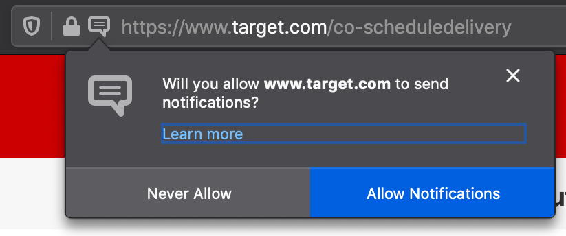

## General Overview:
Install browser extension. Trigger the extension when you are on the webpage which states "no delivery windows are available". Notification will be posted when a slot opens. If your session logs out, it will also notify you to login again.

Currently only in Firefox.

## Supported sites:
* Target (shipt)
* Instacart
* Amazon Fresh

## Installation:
Currently in beta testing (covid-19 limited release) with Friends&Fam. Has not gone through the add-on/extension review process yet. Must manually install.

1. Download the extension.
    * For non-devs, click here to download: [Mac OS users.](https://github.com/wiedld/open-delivery-slot/archive/master.tar.gz) [Windows users.](https://github.com/wiedld/open-delivery-slot/archive/master.zip)
    * unzip/extract the download.

2. Install the extension locally.
    * Follow the below instructions. The file you are seeking (after upzipping) is `./open-delivery-slot/firefox/manifest.json`.
    * https://extensionworkshop.com/documentation/develop/temporary-installation-in-firefox/
    * on successful installation, you should witness the hedgehog.

## How to Use:
1. Fill your shopping cart. Get to the point where the Delivery options are posted (if available).

2. Click the icon 

3. **First time, per website**:
    * notifications request will pop-up in Firefox toolbar.
    * 
    * after approval, reload the page.

4. Leave your tab open, and session active. (Use other tabs to keep browsing normally.)

5. OpenDeliverySlot will reload the page every few minutes, and push a notification if a slot opens up.

6. If you navigate away from that page (within that tab) and return, then you will need to trigger the watcher again.

## Troubleshooting:
* Firefox Preferences does not explicitly have settings to enable/disable certain Service Workers. As a result, if you have selected `"Never remember history"` then it will disable the workers. Instead, we recommend `"Use custom settings for history"` and to select/deselect the subcategories.
* Installation is performed as a temporary plugin. If you restart your browser, you need to repeat step #2 under "Installation".

## Etc

#### Caveats:
Based on frontend web scraping. Hence, this add-on is really only intended for short-term covid-19 life.

#### TODO (not asap, not likely doing):
* lower prio: installation pages, info, etc. See: short-term.
* firefox extension approve/release.

#### FIXME before any "official" deployment:
* make chrome version? move the webscraping versions over to chrome (which doesn't have the needed webRequest APIs).
* convert firefox add-on (target & instacart) to use webRequest.filterResponseData().
* amazon uses server-side rendering, nor found amazon fresh API with a cursory search. alternative approach needed.
